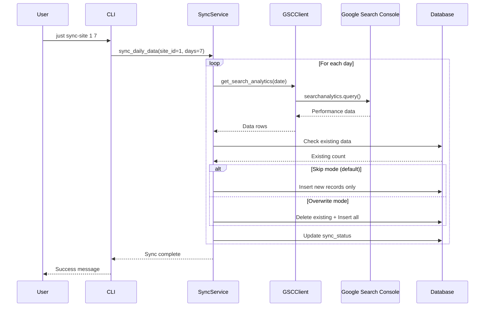
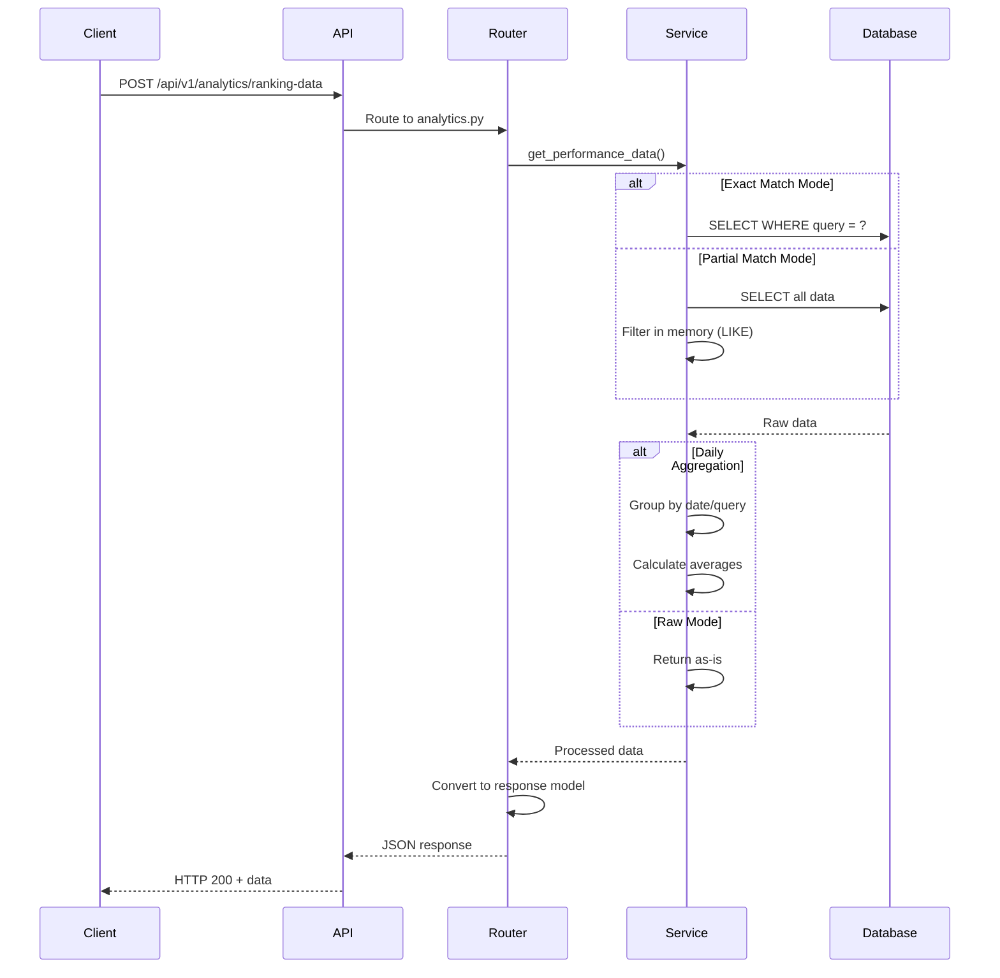
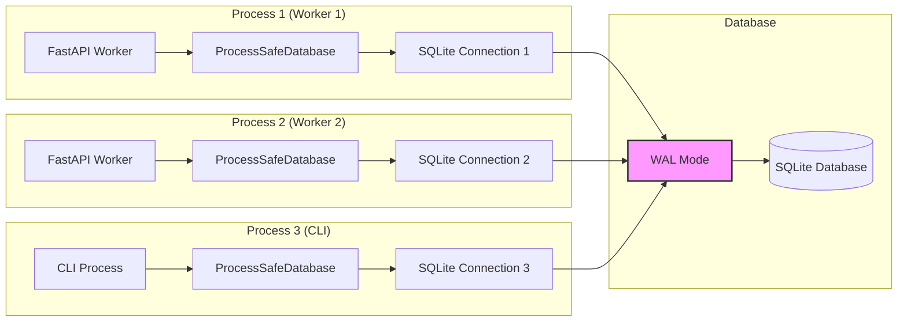
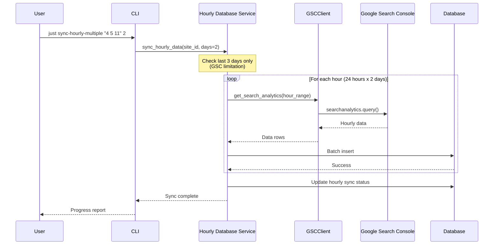
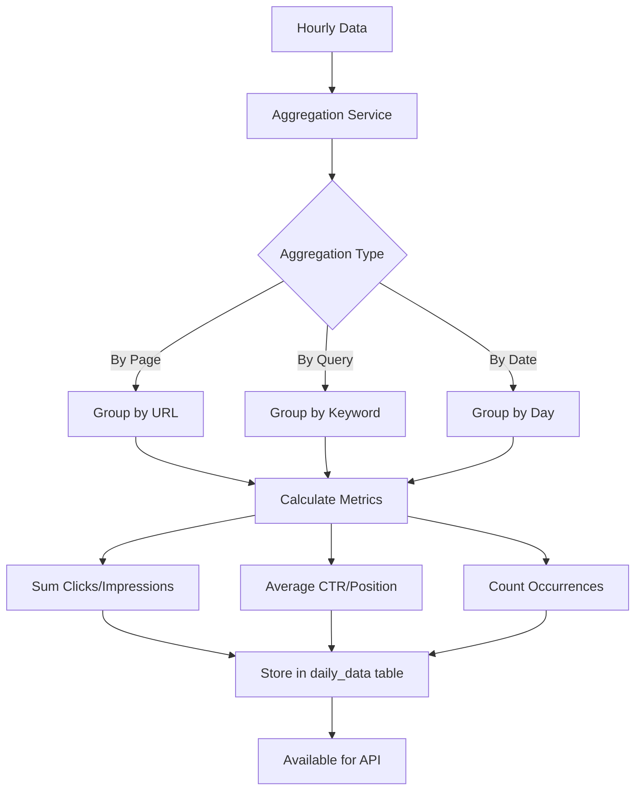
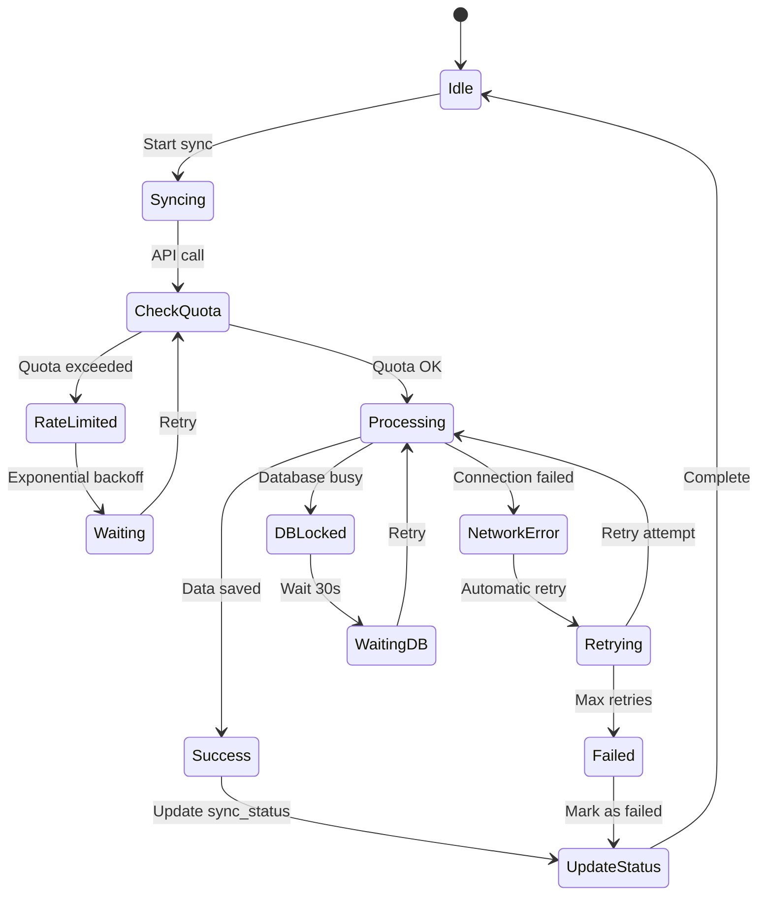
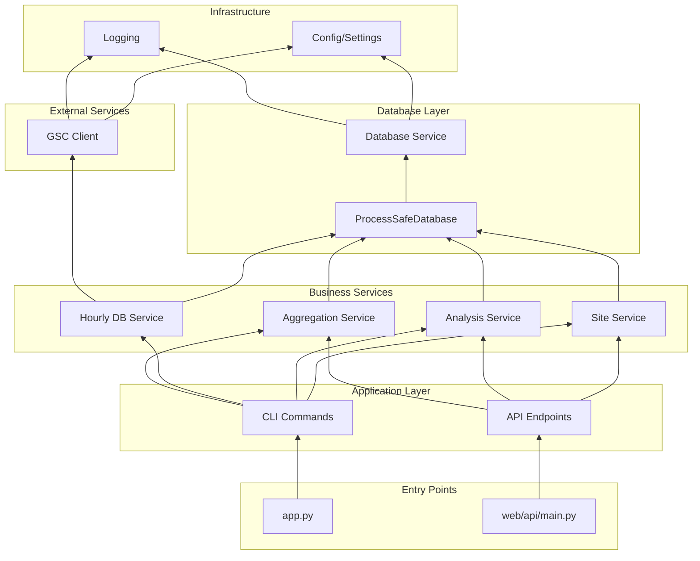
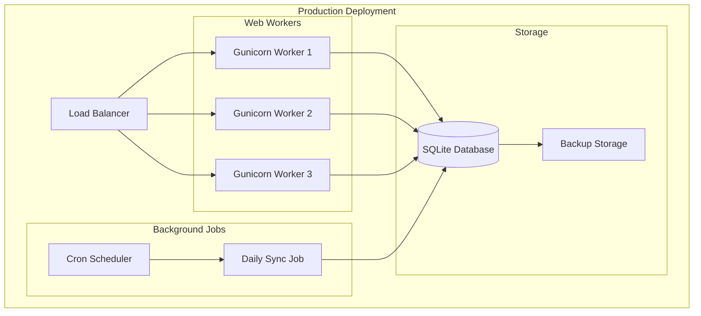

# GSC Database System Flow Diagram

## Overview

This document describes the complete system architecture and data flow of the GSC Database Management System, including all components, services, and their interactions.

## System Architecture

```mermaid
graph TB
    subgraph "External Services"
        GSC[Google Search Console API]
    end

    subgraph "CLI Application"
        CLI[GSC-CLI Command Line]

        subgraph "Commands"
            AUTH[auth login]
            SITE[site add/list]
            SYNC[sync daily/hourly]
            ANALYZE[analyze report]
        end

        CLI --> AUTH
        CLI --> SITE
        CLI --> SYNC
        CLI --> ANALYZE
    end

    subgraph "Web API"
        API[FastAPI Server]

        subgraph "API Routers"
            HEALTH[/health]
            SITES[/api/v1/sites/]
            ANALYTICS[/api/v1/analytics/]
            QUERIES[/api/v1/sites/{id}/queries/]
            PERF[/api/v1/page-keyword-performance/]
            SYNC_API[/api/v1/sync/]
            DIAG[/api/v1/diagnostics/]
        end

        API --> HEALTH
        API --> SITES
        API --> ANALYTICS
        API --> QUERIES
        API --> PERF
        API --> SYNC_API
        API --> DIAG
    end

    subgraph "Core Services"
        DI[Dependency Injection Container]

        subgraph "Service Layer"
            GSC_CLIENT[GSC Client Service]
            SITE_SVC[Site Service]
            ANALYSIS_SVC[Analysis Service]
            AGG_SVC[Data Aggregation Service]
            HOURLY_DB[Hourly Database Service]
        end

        DI --> GSC_CLIENT
        DI --> SITE_SVC
        DI --> ANALYSIS_SVC
        DI --> AGG_SVC
        DI --> HOURLY_DB
    end

    subgraph "Data Layer"
        DB_WRAPPER[ProcessSafeDatabase]
        DB[SQLite Database]

        DB_WRAPPER --> DB

        subgraph "Tables"
            SITES_TBL[sites]
            DAILY_TBL[gsc_performance_data]
            HOURLY_TBL[gsc_hourly_data]
            SYNC_TBL[sync_status]
        end

        DB --> SITES_TBL
        DB --> DAILY_TBL
        DB --> HOURLY_TBL
        DB --> SYNC_TBL
    end

    %% Connections
    GSC_CLIENT --> GSC

    AUTH --> GSC_CLIENT
    SITE --> SITE_SVC
    SYNC --> GSC_CLIENT
    SYNC --> DB_WRAPPER
    ANALYZE --> ANALYSIS_SVC

    SITES --> SITE_SVC
    ANALYTICS --> ANALYSIS_SVC
    QUERIES --> DB_WRAPPER
    PERF --> ANALYSIS_SVC
    SYNC_API --> DB_WRAPPER
    DIAG --> DB_WRAPPER
    DIAG --> GSC_CLIENT

    SITE_SVC --> DB_WRAPPER
    ANALYSIS_SVC --> DB_WRAPPER
    AGG_SVC --> DB_WRAPPER
    HOURLY_DB --> DB_WRAPPER

    CLI --> DI
    API --> DI
```

## Data Synchronization Flow



## API Request Flow



## Multi-Process Database Access



## Query Search Feature Flow

```mermaid
graph TD
    A[User Request] -->|Search "理髮"| B{Search Type?}

    B -->|Simple Search| C[GET /queries/search]
    B -->|Complex Filter| D[POST /analytics/ranking-data]

    C --> E[Direct SQL LIKE Query]
    E --> F[SELECT WHERE query LIKE '%理髮%']

    D --> G{Matching Mode?}
    G -->|exact| H[Query Each Term]
    G -->|partial| I[Get All + Filter]

    H --> J[SELECT WHERE query = '理髮']
    I --> K[SELECT all queries]
    K --> L[Filter: if '理髮' in query]

    F --> M[Return Results]
    J --> M
    L --> M

    M --> N[Format Response]
    N --> O[JSON to Client]
```

## Hourly Data Synchronization



## Data Aggregation Pipeline



## Error Handling and Recovery



## Component Dependencies



## Key Features and Flows

### 1. **Authentication Flow**
- User runs `just auth` or `gsc-cli auth login`
- Opens browser for Google OAuth
- Stores credentials locally
- All subsequent API calls use stored credentials

### 2. **Site Management**
- Add sites with domain verification
- List active sites
- Store site metadata in database
- Support multiple domain formats

### 3. **Data Synchronization**
- **Daily sync**: Historical data with 2-3 day delay
- **Hourly sync**: Recent 3 days with hourly precision
- **Batch sync**: Multiple sites sequentially
- **Progress tracking**: Real-time status updates

### 4. **API Endpoints**
- **Health check**: Process and connection status
- **Site listing**: All configured sites
- **Analytics**: Flexible data queries with filters
- **Query search**: Partial matching for keywords
- **Performance**: Page-keyword combinations
- **CSV export**: Direct data download

### 5. **Data Processing**
- **Aggregation modes**: Raw vs daily summarized
- **Matching modes**: Exact vs partial for queries
- **Time ranges**: Flexible date filtering
- **Grouping**: By query, page, or date

### 6. **Concurrency & Safety**
- Process-safe database connections
- WAL mode for concurrent access
- Automatic retry with backoff
- Connection pooling per process

## Deployment Architecture



## Performance Considerations

1. **Sequential Processing**: GSC API calls are sequential to avoid rate limits
2. **Batch Operations**: Database inserts use batch operations
3. **Connection Reuse**: Per-process connection pooling
4. **Data Pagination**: API responses limited to prevent memory issues
5. **Index Optimization**: Database indexes on common query patterns

## Security Features

1. **OAuth 2.0**: Secure Google authentication
2. **Local Credentials**: Encrypted credential storage
3. **Process Isolation**: Each process has isolated connections
4. **Input Validation**: Pydantic models validate all inputs
5. **SQL Injection Prevention**: Parameterized queries throughout

## Monitoring Points

- API response times
- Sync job success/failure rates
- Database connection pool status
- GSC API quota usage
- Error rates by endpoint
- Data freshness metrics
